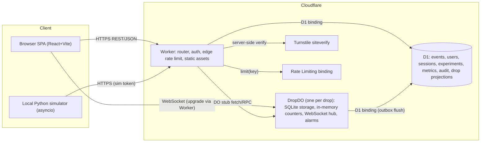

# Fair Drop — Architecture

> Companion docs: [state-machines](state-machines.md) · [data-model](data-model.md) · [api-contract](api-contract.md) · [fairness-model](fairness-model.md) · [threat-model](threat-model.md) · [experiment-methodology](experiment-methodology.md) · [roadmap](implementation-roadmap.md) · [decisions](phase0-decisions.md)

## 1. Goal in one sentence

Separate **traffic** (requests: their speed, volume, retries) from **allocation** (who gets a ticket). Ticket ownership is decided by a seeded, auditable lottery over a frozen, deduplicated participant pool, and inventory changes only through a single serialized, transactional state machine.

## 2. System overview



### 2.1 Components

| Component | Responsibility | Not responsible for |
|---|---|---|
| **Worker** (`apps/worker/src/index.ts`) | Serve SPA assets. Route `/api/v1/*`. Verify session cookie / admin cookie / sim token. Edge rate limit (per IP/network). Turnstile siteverify. Read-mostly D1 queries (events, experiments, results, audit). Forward drop-scoped calls to the right `DropDO`. | Any inventory or participant mutation |
| **DropDO** (`apps/worker/src/drop/DropDO.ts`) | Authoritative drop state machine, participant registry + dedupe, authoritative rate limits, risk engine, allocation, offers/holds/confirmations, expiry (alarms or virtual clock), integrity counters, metrics aggregation, WebSocket broadcast, outbox to D1. | Cross-drop queries, user accounts |
| **D1** | Durable records: events, drops (metadata), users, sessions, experiments, metric snapshots, results, audit records, final drop projections (participants/allocations/reservations/tickets). | Live per-op state |
| **SPA** (`apps/web`) | Consumer flow, Stress Lab, live dashboard, results, audit verification (recomputes allocation in-browser using `packages/shared`). Aggregates telemetry. | Authoritative state (never trusted) |
| **Simulator** (`simulator/`) | Generate a deterministic population from a seed, drive logical or real-HTTP runs, measure client-side latency, upload labels after allocation. | Computing official fairness numbers (the server computes them from authoritative state + uploaded labels; the simulator recomputes them independently as a cross-check) |
| **packages/shared** | TS types, zod request/response schemas, the allocation algorithm, hash/canonicalization, metric definitions. | — |

### 2.2 Internal module boundaries inside `DropDO` (modular monolith)

```
DropDO
 ├─ lifecycle/      drop state machine + transition guards
 ├─ admission/      registration, dedupe, freeze, snapshot hash         (Mechanism 1)
 ├─ allocation/     seed commit/reveal, rank, winners/waitlist, naive   (Mechanism 1)
 ├─ controls/       token buckets, idempotency cache, session tracking  (Mechanism 2)
 ├─ risk/           feature store, scoring, decisions                   (Mechanism 3)
 ├─ inventory/      offers, holds, confirmations, expiry, invariants    (Mechanism 4)
 ├─ metrics/        counters, latency histograms, event feed ring buffer
 ├─ live/           WebSocket hibernation hub
 └─ persistence/    SQLite schema, chunk store, outbox → D1
```

Modules talk through plain function calls inside a single request turn. Only `inventory/` may write `tickets`, and only `lifecycle/` may change `drop.state`.

## 3. Authoritative state

| State | Authority | Copies / projections |
|---|---|---|
| Drop phase, participant status, tickets, offers, holds, confirmations, waitlist position | **DropDO SQLite** | D1 projection (async, outbox). SPA display |
| Rate-limit buckets, live risk features, live counters | DropDO memory (rebuildable; loss = conservative reset) | Periodic metric snapshot to D1 |
| Users, sessions | **D1** | Signed cookie carries `sid/uid` |
| Event metadata, drop config | **D1** (written at create time, copied into DO at init, immutable after OPEN) | DO copy |
| Experiment config, results, audit records | **D1** | — |
| Seed (secret until reveal) | DropDO storage | Commitment published in D1 at OPEN |

Rule: **the UI never reconstructs authoritative state from memory.** On every load it calls `GET /session` and `GET /drops/:id/me`.

## 4. Connection model

| From → To | Transport | Auth | Notes |
|---|---|---|---|
| Browser → Worker | HTTPS REST/JSON, same origin | `fd_session` HttpOnly, Secure, SameSite=Lax cookie. CSRF: custom header `X-FD-Client: web` required on mutations + SameSite | All responses `Cache-Control: no-store` except public drop status (1 s edge cache) |
| Browser → Live dashboard | `GET /api/v1/experiments/:id/live` → Worker validates admin cookie or viewer token → forwards Upgrade to DropDO | Same | Hibernation API. Server→client only (client sends just ping) |
| Worker → DropDO | `env.DROP_DO.get(idFromName(drop_id))` + RPC methods | Worker passes a verified `Principal` object (`{kind: user\|sim\|admin, uid, sid, network_key, device_id}`) | DO trusts the Worker, never the client |
| Worker → D1 | `env.DB` prepared statements, `batch()` | — | Read-mostly |
| DropDO → D1 | `env.DB.batch()` from outbox flush (alarm every 2 s or at phase change) | — | At-least-once. All projection writes are UPSERTs keyed by natural keys, so they're idempotent |
| Worker → Turnstile | `POST https://challenges.cloudflare.com/turnstile/v0/siteverify` | `TURNSTILE_SECRET` | Checks `success`, `hostname`, `action = "fd_challenge"`, `cdata = participant_id`, and that the token is single-use |
| Simulator → Worker (real HTTP) | HTTPS, HTTP/2, many connections | Per-session cookies created via the public session endpoint, + `X-FD-Sim-Token`, + `X-FD-Sim-Client: <virtual network key>` | Goes through the **same public endpoints and code path** as browsers |
| Simulator → Sim API (logical) | HTTPS `POST /api/v1/sim/experiments/:id/batches` | `Authorization: Bearer <sim token>` (HMAC, experiment-scoped, ≤ 2 h expiry) | ≤ 1,000 ops/batch. Ordered `batch_seq`. Virtual clock |

### 4.1 Edge identity / network key

`network_key` = `cf-connecting-ip` truncated to IPv4 /24 or IPv6 /56. For sim drops with a valid sim token only, it comes from `X-FD-Sim-Client` instead. Otherwise every simulated client would share the developer's IP and be collapsed by the IP limiter, which would make the experiment meaningless. A sim token is never accepted on a non-experiment drop.

## 5. The four mechanisms (implementation terms)

### 5.1 Mechanism 1 — Fair admission + allocation

**Fair-mode drop timeline:** `REGISTRATION_OPEN` (window W, default 15 min) → `REGISTRATION_CLOSED` (pool frozen) → `ALLOCATING` → `BOOKING_OPEN` → `CLOSED`.

1. **Register** (`POST /drops/:id/register`): the Worker authenticates the session and the DO runs:
   - Compute `participant_key = account_id` (one participant per account per drop). Logical sim: `account_ref` from the batch.
   - If `participants[participant_key]` exists → return the existing state with `deduplicated: true`, increment `dedup_count`, **no new entry**.
   - Else insert `participant {id: random 128-bit (ULID), status: REGISTERED, registered_at, session_id, device_id, network_key}`.
   - Arrival time is recorded **for metrics only**. It has no role in allocation.
2. **Waiting room**: `GET /me` returns `{status, phase, registration_closes_at, pool_size_estimate, seed_commitment, next_poll_ms}`. Being early confers nothing, and the UI says so explicitly.
3. **Freeze** (at `registration_closes_at`, alarm/virtual clock): transition to `REGISTRATION_CLOSED`. For each REGISTERED participant:
   - risk action `RESTRICT`, or `CHALLENGE` not passed → `INELIGIBLE` (reason recorded)
   - cross-account duplicate cluster rule hit (§5.2) → `INELIGIBLE (DUPLICATE_IDENTITY)` for all but the earliest member *only if* identical normalized email hash. Shared device/network only raises risk, it never auto-excludes.
   - otherwise → `ELIGIBLE`.
   - **Snapshot**: canonical list = eligible `participant_id`s sorted ascending (byte order), joined by `\n`. `snapshot_hash = SHA-256(list)`. Stored + projected to D1 (chunked).
4. **Allocate** (`ALLOCATING`): algorithm `fairdrop-hmac-rank-v1`:
   ```
   at OPEN:   server_seed  = 32 random bytes (crypto.getRandomValues)
              commitment   = hex(SHA-256(server_seed))                -- published
   at alloc:  final_seed   = SHA-256("fairdrop-hmac-rank-v1" ‖ server_seed ‖ snapshot_hash)
              rank_key(p)  = HMAC-SHA256(key=final_seed, msg=participant_id)
              order        = eligible sorted by (rank_key asc, participant_id asc)
              winners      = order[0 : min(N, |eligible|)]   N = total_inventory (500)
              waitlist     = order[N : ]   (waitlist_rank = index − N + 1)
              result_hash  = SHA-256(join(order, "\n"))
   ```
   Winners → `ALLOCATED` (offer with `offer_expires_at`), others → `WAITLISTED`. Then `server_seed` is revealed (D1 audit record) and the phase goes to `BOOKING_OPEN`.
   - Each participant gets exactly one rank key, so the number of requests sent has no effect on `|eligible|` entries. **Invariant I-1/I-3.**
   - Arrival time is not an input, so speed has no effect. **Invariant I-2.**
   - Anyone can recompute it from `{server_seed, snapshot list}` using the published algorithm (audit view runs `packages/shared/allocation.ts` in the browser).
5. **Waitlist promotion**: when an offer expires, is released or a hold expires (and the participant is not confirmed), the DO promotes the lowest-ranked WAITLISTED participant to ALLOCATED, as long as `active_offers + held + confirmed < N` and the booking window has time left.

**Naive mode (`naive-fcfs-v1`)**: phases `BOOKING_OPEN → CLOSED` only. There is no registration window, lottery, risk engine or rate limits. A `reserve` attempt creates a hold immediately if a ticket is AVAILABLE and the account doesn't already own a hold/ticket (cap 1 per account, same as fair mode). Atomicity and integrity are identical (same `inventory/` module), so the comparison isolates *allocation policy*.

### 5.2 Mechanism 2 — Request + identity control

Layered. Each layer is cheap enough for its position.

| Layer | Where | Key | Policy (defaults, configurable per drop) | Action on breach |
|---|---|---|---|---|
| L0 Edge IP/network | Worker, RL binding (60 s window) | `network_key` | 300 req/60 s all APIs. 30 req/60 s `register`+`session` | 429 `RATE_LIMITED`, `Retry-After`. Counts as `blocked_edge` (reported via sampled counter header to DO) |
| L1 Session token bucket | DropDO memory | `session_id` | `me`: burst 5, 1 per 2 s · `register`: burst 3, 1/10 s · `reserve`/`confirm`: burst 3, 1/5 s · `telemetry`: 1/10 s | 429 + risk feature `rl_hits++` |
| L2 Account bucket | DropDO memory | `account_id` | Sum across sessions = 2× L1 | 429 |
| L3 Participant semantic dedupe | DropDO | `(drop, participant, action)` | Repeat register/reserve/confirm returns the existing result | 200 `deduplicated: true`, `dedup_count++` |
| L4 Idempotency-Key | DropDO (memory LRU 50k + persisted for reserve/confirm) | `(participant, key)` | Same key + same body hash → cached response. Same key + different body → 422 | — |
| L5 Concurrent sessions | DropDO | `account_id → set(session_id active in last 60 s)` | > 2 concurrent → risk feature `parallel_sessions`. > 5 → THROTTLE floor | Risk |
| L6 Token binding | Worker + DO | Session cookie HMAC + `device_id` bound at session creation. Hold/offer IDs are bound to participant | Mismatched device for same `sid` → `token_reuse` risk + session revoked | 401 |
| L7 Cross-account clustering | DropDO at register + freeze | `email_hash` (exact dup → ineligible), `device_id` shared by > 3 accounts, `network_key` with > 50 registrations | Risk signal only, except exact email dup | Risk |

Email normalization: lowercase, trim, strip `+tag`, strip dots for gmail/googlemail. `email_hash = HMAC-SHA256(PII_PEPPER, normalized)`. Raw email is not stored (or stored only for display, Phase 8 decision OD-6).

**Request collapse principle**: once a participant exists, further register requests can never create state. Once a hold exists, further reserve requests return that hold. Rate limits protect *capacity*, and semantic dedupe protects *fairness*.

### 5.3 Mechanism 3 — Behavioral abuse detection

**Browser aggregation** (`apps/web/src/telemetry/`): listeners update in-memory counters only. A summary is flushed at most every 10 s, on route change, and on `register` (piggy-backed). Raw coordinates are never sent.

Telemetry summary v1 (per window):
```
{ v:1, window_ms, route_seq:[...last 8 route ids], dwell_ms_by_route:{},
  pointer:{moves, distance_px_bucket, straightness_ratio_bucket, speed_var_bucket},
  touch:{events}, clicks, keys:{count, interval_var_bucket}, scrolls,
  visibility_changes, focus_changes, refreshes, nav_timing:{ttfb_bucket, dom_ready_bucket},
  input_modality: "pointer"|"touch"|"keyboard"|"mixed"|"none",
  client_req:{count, retries, max_concurrency} }
```
Buckets are coarse (e.g. log2) to reduce fingerprinting and payload size.

**Server-side features** (DO, per session and participant): request rate, burst count (> 5 req/s), concurrency, retries, duplicates collapsed, `requests / interactions` ratio, reconnects, token reuse, parallel sessions, abnormal transitions (e.g. `reserve` before `register`, calling `/reserve` without ever calling `/me`).

**Scoring** (`risk/score.ts`, `risk-v1`): additive points per rule. Each rule belongs to one of 4 categories (Interaction, Navigation, Network, Session). **Each category's contribution is capped at 35.** Score is 0–100.

| Score | Action | Effect |
|---|---|---|
| < 30 | ALLOW | — |
| 30–54 | THROTTLE | L1 bucket rates halved |
| 55–79 | CHALLENGE | Turnstile required before eligibility (fair) / before next reserve |
| ≥ 80 | RESTRICT | Ineligible / requests rejected 403 |

Multi-signal guarantees:
- Because of the 35 cap, **one category alone can at most THROTTLE**, and CHALLENGE needs ≥ 2 categories.
- RESTRICT needs ≥ 3 categories **or** hard evidence (`token_reuse` across devices, ≥ 2 failed challenges). Hard-evidence rules are listed explicitly and are not behavioral guesses.
- Absence of pointer movement adds at most 8 points, and 0 if `input_modality ∈ {touch, keyboard}` (accessibility).
- Passing a challenge lowers the score to `min(score, 29)` for 10 min, but Network/Session rules keep accruing.

Every decision stores `reasons: [{rule_id, category, points, evidence}]`, so it can be explained in the UI and the audit. Decisions are persisted to `risk_decisions` **only when the action changes** (not per request), which keeps the write budget low (I-10).

Example rules (full table finalized in Phase 7):

| rule_id | Category | Condition | Points |
|---|---|---|---|
| NET_BURST | Network | > 5 req/s sustained 3 s | 15 |
| NET_RL_HITS | Network | ≥ 3 L1 breaches | 15 |
| NET_DUP_RATIO | Network | duplicates/requests > 0.8 with ≥ 20 requests | 10 |
| NET_REQ_INTERACT | Network | requests/interactions > 20 | 10 |
| INT_NONE | Interaction | no pointer/touch/key events across ≥ 2 windows and modality=none | 8 |
| INT_LINEAR | Interaction | straightness bucket = max and speed variance bucket = min | 12 |
| INT_KEY_UNIFORM | Interaction | key interval variance bucket = min with ≥ 20 keys | 10 |
| NAV_SKIP | Navigation | API flow without the corresponding route sequence | 15 |
| NAV_DWELL_MIN | Navigation | dwell < 300 ms on every route | 10 |
| NAV_REFRESH | Navigation | refreshes > 10/min | 10 |
| SES_PARALLEL | Session | > 2 concurrent sessions on account | 15 |
| SES_SHARED_DEVICE | Session | device_id seen on > 3 accounts | 20 |
| SES_RECONNECT | Session | > 20 session recoveries/10 min | 10 |
| HARD_TOKEN_REUSE | Hard | same `sid` from two device IDs | → RESTRICT |
| HARD_CHALLENGE_FAIL | Hard | 2 failed challenges | → RESTRICT |

### 5.4 Mechanism 4 — Atomic reservation + inventory integrity

- **Serialization**: all mutations run inside the single-threaded DropDO. Multi-statement changes use `ctx.storage.transactionSync()`, so there is no interleaving and no partial writes.
- **Ticket table**: 500 rows created at drop init, `status ∈ {AVAILABLE, HELD, CONFIRMED}`, `holder_participant_id` nullable, plus a UNIQUE partial index on `holder_participant_id WHERE holder_participant_id IS NOT NULL` → **one participant ≤ one ticket** (I-3/I-4).
- **Reserve** (participant ALLOCATED, offer not expired): in one transaction: check for an existing active reservation (return it if present, idempotent) → pick the lowest-numbered AVAILABLE ticket → set ticket HELD + holder → insert reservation `HELD` with `expires_at = now + hold_ttl` → participant `HELD` → counters.
- **Confirm**: reservation HELD and not expired → ticket CONFIRMED, reservation CONFIRMED, participant CONFIRMED. Repeat confirm → same result.
- **Release / Expire**: reservation → RELEASED/EXPIRED, ticket → AVAILABLE + holder NULL, participant → HOLD_EXPIRED / RELEASED, then waitlist promotion.
- **Expiry driver**: wall-clock drops use a DO alarm set to the earliest `expires_at`. Virtual-clock drops sweep at the start of every batch using `virtual_now`. **Lazy check** too: any read/confirm treats `expires_at ≤ now` as expired and sweeps first, so an alarm delay can never let a stale hold confirm.
- **Invariant check**: after every inventory transaction, `available + held + confirmed == total` is checked against in-memory counters (O(1)). Every 5 s and at CLOSE, a full `SELECT status, COUNT(*)` scan runs, plus a duplicate-holder scan. Any mismatch → `inventory_drift` metric, critical event in the feed, drop goes to `HALTED` (no further mutations) for investigation.

## 6. Architectural invariants

| ID | Invariant | Enforced by | Verified by |
|---|---|---|---|
| I-1 | Request volume never creates allocation entries | Participant keyed by account. Lottery input = eligible snapshot | `lottery_entries == eligible_count`. RVA metric |
| I-2 | Request speed does not determine allocation | Arrival time not an input to rank | Arrival Advantage Ratio, Jain over arrival deciles |
| I-3 | One logical participant ≤ one allocation entry | PK on `(drop, participant_key)`, unique holder index | Duplicate-allocation scan |
| I-4 | One ticket allocated/confirmed at most once | Ticket row single holder, transactional transitions | Duplicate-holder scan, oversell count |
| I-5 | Inventory is always consistent | Single-threaded DO + transactions | `available+held+confirmed == total` continuous + full scan |
| I-6 | Reservation retries are idempotent | Semantic natural keys + Idempotency-Key | Retry-storm scenario: `reservations_created ≤ allocated` |
| I-7 | Refresh/reconnect never resets authoritative state | State in DO/D1, SPA rehydrates from `/me` | Refresh scenario test |
| I-8 | Behavioral detection is multi-signal | Category cap 35, RESTRICT rule | Unit tests on score engine |
| I-9 | Behavioral detection is not the only fairness defense | Lottery + dedupe work with risk engine disabled | Ablation run `risk=off` |
| I-10 | High-frequency telemetry doesn't overload D1 | Browser aggregation, DO memory, change-only decisions, outbox batching | D1 rows written per run (reported) |
| I-11 | Sim/admin APIs aren't publicly exploitable | Admin cookie / scoped sim token, experiment-drop-only virtual network | Negative auth tests |
| I-12 | Experiment results are reproducible from stored metadata | Stored config, population seed + hash, allocation seed, snapshot, result hash | Audit verify endpoint + browser recompute |

## 7. Frontend surfaces

| # | Route | Surface | Data source |
|---|---|---|---|
| 1 | `/` | Event landing (FUTUREFEST 2026, drop countdown, "how fair drop works") | `GET /events/futurefest-2026` |
| 2 | `/drop/:dropId` | Registration (join button, explains lottery, invisible Turnstile only if challenged) | `/session`, `/drops/:id`, `POST register` |
| 3 | `/drop/:dropId/waiting` | Waiting room (countdown to close, pool size, seed commitment, "arriving early gives no advantage") | `/me` polling |
| 4 | `/drop/:dropId/result` | Allocation result (won / waitlisted #k / ineligible + reason) | `/me` |
| 5 | `/drop/:dropId/checkout` | Reservation / checkout with hold countdown | `POST reservations`, `confirm` |
| 6 | `/drop/:dropId/ticket` | Ticket confirmation (ticket #, QR placeholder) | `/me` |
| 7 | `/lab` | Stress Test Lab (admin): build scenario, choose mode(s), seed, launch instructions/run status | `/sim/*` |
| 8 | `/lab/experiments/:id/live` | Live dashboard (counters, rates, latency, integrity, event feed) | WebSocket |
| 9 | `/lab/experiments/:id/results` (+ `/lab/compare/:comparisonId`) | Results & A/B comparison | `GET /experiments/:id/results` |
| 10 | `/audit/:dropId` | Audit / verify allocation (public) | `GET /drops/:id/audit` + in-browser recompute |

Two visual systems share one component library: **consumer** (bright, product-grade, mobile first) and **console** (dark, dense, monospaced numbers, data grids). The route decides which one is used (`/lab/*`, `/audit/*` → console).

The SPA stores only `last_known_drop_id` in localStorage, as a convenience. Everything else comes from the server.

## 8. Scaling path (no redesign)

1. Workers Paid: the same code with higher quotas.
2. Registration hot-spot: shard intake across `K` `RegistrationShardDO`s (hash of account) that forward compact batches to `DropDO` at freeze. The allocation input stays the same snapshot.
3. Status read fan-out: publish per-participant result in a KV/edge cache after allocation.
4. Move telemetry analytics to Workers Analytics Engine.
