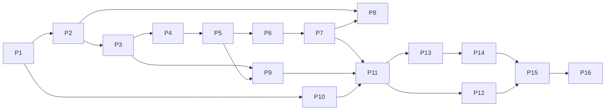

# Fair Drop — Implementation Roadmap

Ordered phases. Each phase ends with green tests and a short entry in `docs/phase0-decisions.md` §6 if a decision changed. Test stack: **Vitest + `@cloudflare/vitest-pool-workers`** (Worker/DO/D1 in workerd), **Playwright** (frontend), **pytest** (simulator).

| Phase | Objective | Components touched | Depends on | Tests required | Completion criteria |
|---|---|---|---|---|---|
| **1 — Cloudflare foundation** | Monorepo, Worker serving SPA + `/api/v1/health`, DO class bound, D1 bound, secrets, CI | pnpm workspace, `apps/worker`, `apps/web` (blank), `packages/shared`, `wrangler.jsonc`, GitHub Actions | — | health route test, DO ping test, D1 ping test | `wrangler deploy` works. `/api/v1/health` returns `{worker, do, d1: ok}` in prod. Free-tier limits re-verified and noted |
| **2 — Database/event model** | D1 migrations (all Part A tables), DO SQLite schema (Part B), seed FUTUREFEST 2026, sessions + users | `migrations/`, `persistence/`, `/events`, `/session` | 1 | migration up from empty, unique-constraint tests (email_hash, (drop,user)), session create/recover/revoke, cookie HMAC tamper test | `GET /events/futurefest-2026` live. Session survives refresh in browser. Revoked cookie → 401 |
| **3 — Drop state machine** | `lifecycle/` with all transitions, guards, alarms, virtual clock, HALTED | DropDO, admin endpoints | 2 | table-driven test of every legal/illegal transition, alarm-driven open/close, virtual clock monotonicity | Drop goes DRAFT→…→CLOSED via clock on both WALL and VIRTUAL. Illegal transitions → 409 with no change |
| **4 — Fair allocation engine** | Registration, dedupe, freeze, snapshot hash, commit-reveal, `fairdrop-hmac-rank-v1`, waitlist | `admission/`, `allocation/`, `packages/shared/allocation.ts` | 3 | golden-vector test (fixed seed+snapshot → fixed winners), determinism across runs, statistical test (10k simulated lotteries: per-position win frequency χ² p > 0.01), 50k-allocation CPU benchmark in workerd, repeat register → 1 participant | `lottery_entries == eligible`. Browser and server produce identical results. 50k allocation within DO CPU budget |
| **5 — Inventory/reservation engine** | Tickets, offers, holds, confirm, release, expiry (alarm/lazy/virtual), promotion, invariant checker | `inventory/` | 4 | property-based test (fast-check: random op sequences preserve I-3/I-4/I-5), concurrent-reserve test (1,000 parallel calls), expiry → promotion test, idempotent confirm | Zero violations across 10k random sequences. Invariant breach → HALTED (tested by fault injection) |
| **6 — Request/identity controls** | L0 RL binding, L1/L2 buckets, semantic + key idempotency, concurrent sessions, device binding, email normalization | Worker middleware, `controls/` | 5 | bucket math unit tests, 429 + Retry-After, Idempotency-Key conflict 422, token-reuse → revoke, normalization table tests | Flooding one session yields ≤ bucket allowance. Repeats never create state |
| **7 — Behavioral abuse engine** | Telemetry summary schema, browser aggregator, server features, `risk-v1` scoring, Turnstile challenge flow, decisions persistence (on change) | `risk/`, `apps/web/src/telemetry`, `/telemetry`, `/challenge/verify` | 6 | score engine unit tests incl. "single category can't exceed THROTTLE", accessibility cases (keyboard-only → ALLOW), Turnstile verify with Cloudflare test keys (always-pass/always-fail), payload ≤ 4 KB | Every non-ALLOW decision has reasons. Telemetry ≤ 1 req/10 s per tab |
| **8 — Normal booking frontend** | Routes 1–6 with consumer design system, rehydration from `/me`, polling contract, error states | `apps/web` | 2–7 | Playwright: full happy path, refresh at every step preserves state, offline/reconnect, waitlist + promotion path, challenge path | A human can complete register → win → hold → confirm on the deployed site, surviving refresh at each step |
| **9 — Live WebSocket/dashboard layer** | DO hibernation hub, 500 ms snapshots, sampled event feed, viewer tokens | `live/`, `metrics/`, `/experiments/:id/live` | 3, 5 | WS auth tests, broadcast cadence, viewer cap, reconnect resumes with latest snapshot | Dashboard client receives snapshots under load without increasing DO request count beyond budget |
| **10 — Local stress simulator** | Python package: population generator, profiles, virtual-clock timeline engine, logical + real HTTP drivers, client latency histograms, independent metric recomputation | `simulator/` (uv, httpx, pydantic) | 1 (API stubs), contract | pytest: deterministic population for seed, `population_hash` stability, profile parameter distributions, timeline ordering, offline dry-run against mock server | `fairdrop-sim plan --seed 42` reproducible. Dry-run produces expected op counts |
| **11 — Controlled simulation API** | `/sim/experiments`, batches (exactly-once `batch_seq`), control, client-metrics, finalize, labels, capacity model in DO, experiment drops, sim tokens, virtual network header guard | Worker, DropDO `simBatch`, D1 experiments/metrics/artifacts | 4–7, 9, 10 | auth negative tests (no token, wrong scope, sim token on public drop → 403, header spoof ignored on public drop), batch replay idempotency, out-of-order 409, labels hash mismatch 422 | 50k logical FAIR run completes end-to-end on deployed infra within budget. Results computed server-side match simulator recomputation |
| **12 — Stress-test UI** | `/lab` (admin login, scenario builder, profile mix sliders, seeds, launch command generator/run status), `/lab/experiments/:id/live` dashboard | `apps/web` console design system | 9, 11 | Playwright: create experiment, view live dashboard with a running sim, "planned vs labelled" display | A judge can watch a live run with all required dashboard fields |
| **13 — Results + audit** | Results page, comparison page, audit record finalization, snapshot artifacts, `/audit/verify`, in-browser verification | D1 audit/artifacts, `apps/web` results + audit | 4, 11 | audit tamper tests (modified snapshot/seed → verify fails), browser recompute equals server, results render "—" for missing data | Audit page verifies a 50k drop in-browser. All fairness metrics shown with CIs |
| **14 — Naive baseline** | `naive-fcfs-v1` mode, paired comparison runs, comparison view | DropDO mode switch, simulator `compare` command | 5, 11, 13 | same population hash for both modes, naive integrity also zero, deterministic naive outcome in logical mode | `fairdrop-sim compare --scenario mixed_attack --seed 7` produces a comparison page with real numbers for both modes |
| **15 — Adversarial hardening** | Run all scenarios + amplification sweep + ablations + race_reserve. Fix findings. Tune thresholds against human false positives. Optional drand (OD-4) | all | 14 | full scenario matrix, regression suite of previously found bugs, human FP rate ≤ target (e.g. ≤ 2 % challenged) | All integrity metrics 0 in all runs. Findings documented. Residual risks updated in threat model |
| **16 — Deployment & demo prep** | Production config, custom domain, reset/seed scripts, demo runbook, pre-computed *real* comparison runs stored for backup, quota check | ops scripts, README, `docs/demo-runbook.md` | 15 | smoke test script against prod, quota headroom check | Dry-run demo end-to-end twice on prod. Runbook includes fallback if quota is near limit |

## Dependency graph

Parallelizable after Phase 3: frontend scaffolding (8) and simulator (10) can proceed against the API contract with mocks.
