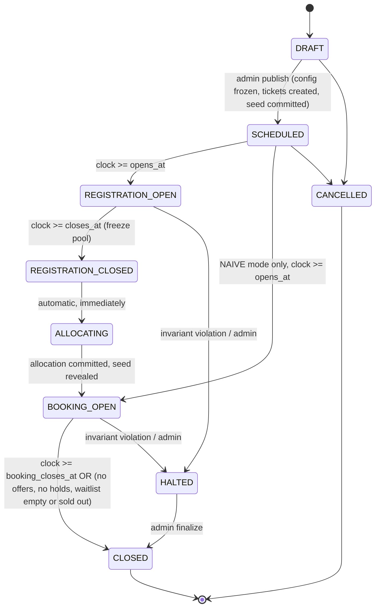
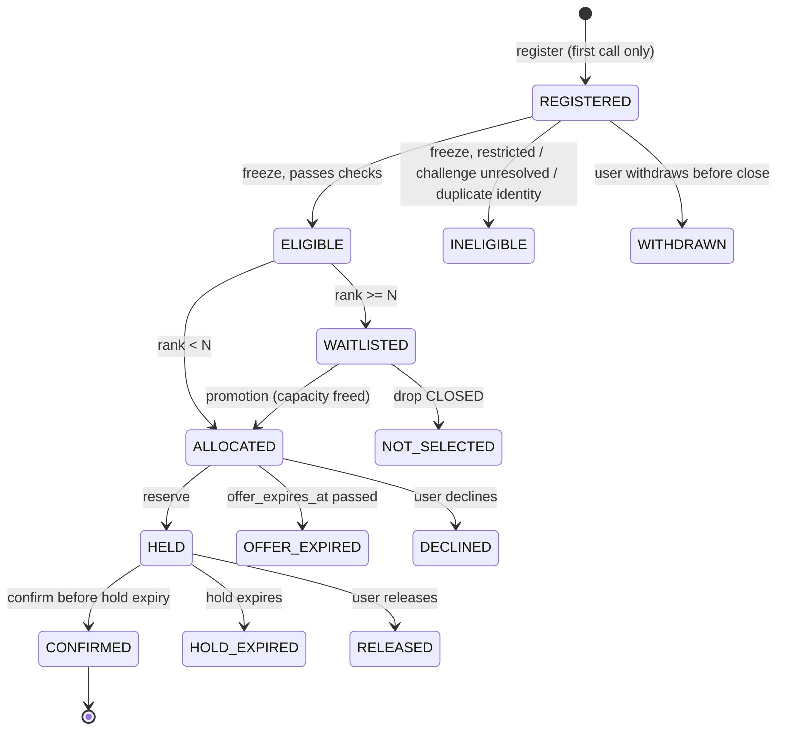
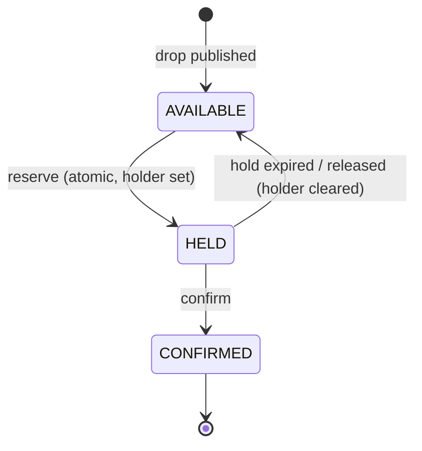
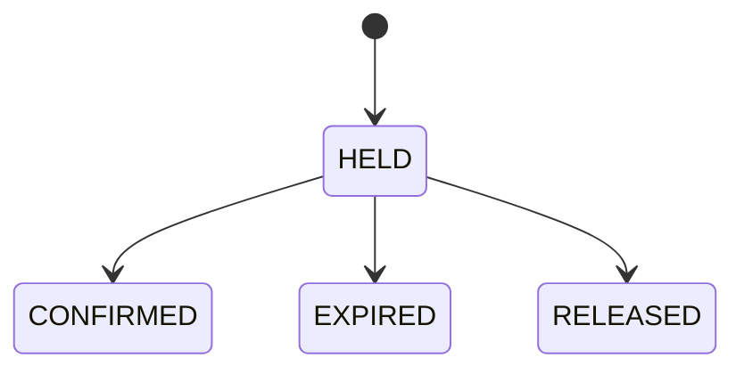
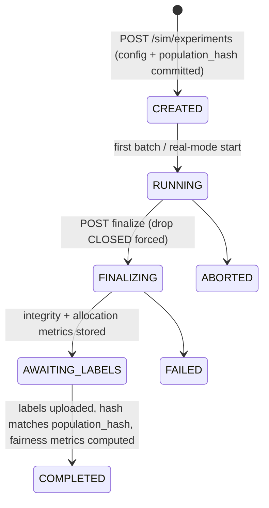

# Fair Drop — State Machines

All transitions are **server-authoritative** and run inside `DropDO` (module noted). Each transition is a single SQLite transaction. Illegal transitions return `409 INVALID_STATE` and change nothing.

## 1. Drop state machine



Differences from the brief:
- **`SCHEDULED`** added. Config, inventory and seed commitment are fixed *before* anyone can register, so the commitment is credible.
- **`ALLOCATED` merged into `BOOKING_OPEN`**. Allocation commits atomically and booking opens in the same transaction, so a separate observable `ALLOCATED` phase adds no behavior. `allocation_committed_at` records the moment.
- **`HALTED`** added. It's a safety stop on any integrity violation: mutations are rejected, reads still work.
- **NAIVE** drops skip registration/allocation.

| Transition | Trigger | Guard | Side effects | Module |
|---|---|---|---|---|
| DRAFT→SCHEDULED | `POST /admin/drops/:id/publish` or experiment creation | config valid, total_inventory > 0 | create N ticket rows, generate `server_seed`, store `seed_commitment`, project to D1 | lifecycle |
| SCHEDULED→REGISTRATION_OPEN | alarm / virtual clock | mode=FAIR | — | lifecycle |
| REGISTRATION_OPEN→REGISTRATION_CLOSED | alarm / virtual clock / sim `close_registration` | — | run freeze (eligibility decisions), compute `snapshot_hash` | lifecycle → admission |
| REGISTRATION_CLOSED→ALLOCATING→BOOKING_OPEN | automatic | snapshot exists | rank, winners → ALLOCATED, rest → WAITLISTED, `result_hash`, reveal seed, audit draft | allocation |
| BOOKING_OPEN→CLOSED | alarm / virtual clock / sold-out condition | — | expire offers/holds, waitlisted → NOT_SELECTED, full integrity scan, final projection, audit record finalized | lifecycle → inventory → persistence |
| *→HALTED | invariant check fails, or admin | — | reject mutations, critical feed event | inventory/lifecycle |

## 2. Participant state machine



NAIVE mode: `[*] → HELD` (reserve succeeds) or `[*] → REJECTED_SOLD_OUT` (non-persistent attempt result), then HELD → CONFIRMED / HOLD_EXPIRED as above.

Terminal states: CONFIRMED, INELIGIBLE, WITHDRAWN, NOT_SELECTED, OFFER_EXPIRED, DECLINED, HOLD_EXPIRED, RELEASED. **Terminal = no second chance in the same drop.** Re-registering is just a deduplicated read. This blocks "release then re-roll" abuse.

| Transition | Trigger | Guard | Responsible |
|---|---|---|---|
| →REGISTERED | `POST register` | phase=REGISTRATION_OPEN, risk≠RESTRICT, no existing participant for account | admission |
| REGISTERED→ELIGIBLE/INELIGIBLE | freeze | see architecture §5.1 step 3 | admission + risk |
| REGISTERED→WITHDRAWN | `POST withdraw` | phase=REGISTRATION_OPEN | admission |
| ELIGIBLE→ALLOCATED/WAITLISTED | allocation commit | — | allocation |
| WAITLISTED→ALLOCATED | capacity freed | `active_offers+held+confirmed < N`, time left ≥ min offer window | inventory (promotion) |
| ALLOCATED→HELD | `POST reservations` | offer valid, AVAILABLE ticket exists (guaranteed by D8) | inventory |
| ALLOCATED→OFFER_EXPIRED | alarm/lazy/virtual sweep | `now ≥ offer_expires_at` | inventory |
| HELD→CONFIRMED | `POST confirm` | `now < hold_expires_at` | inventory |
| HELD→HOLD_EXPIRED / RELEASED | sweep / `POST release` | — | inventory |
| WAITLISTED→NOT_SELECTED | CLOSE | — | lifecycle |

**Orthogonal attributes** (not states): `risk_action ∈ {ALLOW, THROTTLE, CHALLENGE, RESTRICT}`, `challenge_status ∈ {NONE, REQUIRED, PASSED, FAILED}`. In BOOKING_OPEN, a participant whose risk is CHALLENGE must pass the challenge before `reserve`. RESTRICT blocks `reserve` (participant stays ALLOCATED until expiry, then the next waitlisted participant is promoted).

## 3. Ticket state machine



`EXPIRED` is a **reservation** status, not a ticket status. The ticket goes from HELD back to AVAILABLE in the same transaction that marks the reservation EXPIRED. That way the identity `available + held + confirmed = total` holds at every commit point, with no "in limbo" bucket.

## 4. Reservation state machine



Natural key: at most one reservation in `HELD|CONFIRMED` per `(drop, participant)`, enforced by a partial unique index.

## 5. Offer (entitlement) lifecycle

Stored as columns on the participant (`offer_issued_at`, `offer_expires_at`). Capacity identity:

```
active_offers (ALLOCATED, not expired) + held + confirmed ≤ total_inventory
available = total − held − confirmed
```

## 6. Session lifecycle

`ACTIVE → (idle > 30 min) IDLE → (recover with valid cookie) ACTIVE`. Sessions end as `REVOKED` (token reuse / admin) or `EXPIRED` (7 days). Recovery never creates a new participant. The participant is keyed by account, not session.

## 7. Experiment lifecycle


